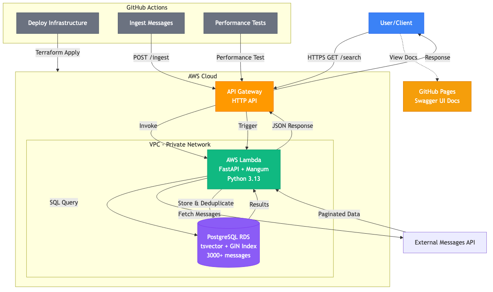

# Aurora Search Engine

A high-performance search engine built on AWS, using PostgreSQL's `tsvector` for full-text search. The system ingests messages from an external API, stores them in PostgreSQL RDS, and exposes a search API via AWS Lambda and API Gateway.

## Assignment Requirements

This project was built to meet the specifications outlined in the [Backend Engineer Assignment](https://gist.github.com/ogurtsov/a4a593b2bacbf6520968d47395d30248).

### Core Requirements ✅

- ✅ **API Service in Latest Stable Python**: Implemented using Python 3.13 with FastAPI
- ✅ **Paginated Results**: Search endpoint supports `page` and `limit` parameters
- ✅ **Deployed & Publicly Accessible**: Live on AWS Lambda + API Gateway
- ✅ **Sub-100ms Response Time**: Achieved 77-92ms average response time

### Bonus Goals ✅

- ✅ **Design Notes**: Alternative approaches documented (see [Alternative Design Approaches](#alternative-design-approaches))
- ✅ **Latency Reduction Strategy**: 30ms optimization strategies documented (see [Reducing Latency to 30ms](#reducing-latency-to-30ms))

**Live API**: https://4vihdxtri6.execute-api.us-east-1.amazonaws.com  
**Documentation**: https://fredericowu.github.io/aurora/

## Architecture



### Components

- **GitHub Actions**: Manual ingestion triggers and infrastructure deployment
- **Ingestion Script**: Fetches messages with pagination, deduplicates by ID
- **PostgreSQL RDS**: Stores messages with `tsvector` column and GIN index for fast search
- **Lambda Function**: FastAPI application with Mangum adapter for serverless deployment
- **API Gateway**: HTTP API exposing the search endpoint
- **GitHub Pages**: Hosts Swagger UI documentation

## Features

- ✅ Full-text search using PostgreSQL `tsvector`
- ✅ Sub-100ms response times
- ✅ Automatic deduplication by message ID
- ✅ Pagination support
- ✅ Auto-generated OpenAPI/Swagger documentation
- ✅ Performance testing script
- ✅ Infrastructure as Code with Terraform

## Prerequisites

- AWS Account with appropriate permissions
- Terraform >= 1.0
- Python 3.11+
- Make (usually pre-installed on Unix systems)
- GitHub repository with Actions enabled
- GitHub Secrets configured (see Setup section)

## Quick Start

### 1. Configure Environment Variables

Create a `.env` file with your AWS credentials:

```bash
cp .env.example .env
# Edit .env with your actual values
```

The `.env` file only needs these essential variables:
- `AWS_ACCESS_KEY_ID`
- `AWS_SECRET_ACCESS_KEY`
- `AWS_REGION` (default: us-east-1)
- `DB_PASSWORD`

All other values (DB_HOST, API_BASE_URL, etc.) will be retrieved automatically from Terraform outputs.

### 2. Deploy Infrastructure

```bash
make deploy
```

This will:
- Validate environment variables
- Initialize Terraform
- Deploy all AWS resources
- Output the API Gateway URL

### 3. Setup Environment from Terraform Outputs

After deployment, populate `.env` with values from Terraform:

```bash
make setup-env
```

This automatically adds:
- `DB_HOST` - RDS endpoint
- `DB_PORT` - RDS port
- `DB_NAME` - Database name
- `API_BASE_URL` - API Gateway URL

### 4. Ingest Messages

```bash
make ingest
```

### 5. Run Performance Tests

```bash
make performance-test
```

## Makefile Commands

All Make targets work in both local and CI/CD environments:

```bash
make help             # Show all available commands
make deploy           # Deploy infrastructure (auto-approve)
make plan             # Plan Terraform changes
make destroy          # Destroy infrastructure (with confirmation in local, auto in CI)
make setup-env        # Setup environment (writes to .env locally, $GITHUB_ENV in CI)
make ingest           # Run message ingestion
make performance-test # Run performance tests
make test-lambda      # Test Lambda endpoints
make clean            # Clean temporary files
```

## GitHub Actions Setup

### Configure GitHub Secrets

Add the following secrets to your GitHub repository:

- `AWS_ACCESS_KEY_ID`: AWS access key
- `AWS_SECRET_ACCESS_KEY`: AWS secret key
- `AWS_REGION`: AWS region (default: us-east-1)
- `DB_PASSWORD`: RDS master password
- `DB_USER`: RDS master username (optional, default: postgres)

### How It Works

The workflows use the same Makefile targets as local development. The targets automatically detect if they're running in CI (via `$GITHUB_ENV`) and adjust their behavior:

- **Local**: Writes to `.env` file, may prompt for confirmation
- **CI/CD**: Exports to `$GITHUB_ENV`, runs non-interactively

### Manual Workflow Triggers

1. **Deploy Infrastructure**: Actions → Deploy Infrastructure → Run workflow
2. **Ingest Messages**: Actions → Ingest Messages → Run workflow

## API Documentation

Swagger UI documentation is available at:
- GitHub Pages: `https://fredericowu.github.io/aurora/`
- Or fetch OpenAPI spec: `https://your-api.execute-api.region.amazonaws.com/openapi.json` (will be available after deployment)

## Project Structure

```
aurora/
├── .github/
│   └── workflows/
│       ├── ingest.yml          # Manual ingestion trigger
│       ├── terraform.yml        # Infrastructure deployment
│       └── deploy-swagger.yml   # Swagger docs deployment
├── lambda/
│   ├── app.py                   # FastAPI application
│   ├── handler.py               # Mangum adapter for Lambda
│   ├── models.py                # Pydantic models
│   ├── database.py              # PostgreSQL connection pool
│   └── requirements.txt
├── scripts/
│   ├── ingest.py                 # Message ingestion script
│   ├── performance_test.py      # Performance testing script
│   └── requirements.txt
├── terraform/
│   ├── main.tf                  # Provider configuration
│   ├── variables.tf             # Input variables
│   ├── vpc.tf                   # VPC, subnets, security groups
│   ├── database.tf              # RDS PostgreSQL
│   ├── lambda.tf                # Lambda function
│   ├── api_gateway.tf           # API Gateway
│   └── outputs.tf               # Output values
├── docs/
│   ├── openapi.yaml             # OpenAPI specification
│   ├── architecture-diagram.mmd # Mermaid diagram source
│   └── swagger-ui/              # Swagger UI files
├── images/
│   └── architecture-diagram.png # Generated architecture diagram
└── README.md
```

## Database Schema

The `messages` table structure:

```sql
CREATE TABLE messages (
    id VARCHAR PRIMARY KEY,
    user_id VARCHAR NOT NULL,
    user_name VARCHAR NOT NULL,
    timestamp TIMESTAMP NOT NULL,
    message TEXT NOT NULL,
    search_vector TSVECTOR
);

CREATE INDEX idx_search_vector ON messages USING GIN(search_vector);
```

The `search_vector` column is automatically updated via a trigger when messages are inserted or updated.

## Performance

The system is designed to meet the <100ms response time requirement:

- **GIN index** on `tsvector` for fast full-text search
- **Connection pooling** in Lambda for efficient database access
- **Prepared statements** for query optimization
- **Pagination** to limit result sets

### Performance Testing

The performance test script runs:
- 1 warm-up call (excluded from results)
- 10 calls with the same search string
- 10 calls with random search strings

It reports:
- Min, max, mean, median (p50), p95, p99 latencies
- Success/failure rates

## Alternative Design Approaches

### 1. Elasticsearch/OpenSearch

**Pros:**
- Purpose-built for search
- Advanced features (fuzzy search, faceting, aggregations)
- Horizontal scaling

**Cons:**
- Additional infrastructure complexity
- Higher cost
- Requires data synchronization

**Why not chosen:** PostgreSQL `tsvector` is sufficient for the requirements and reduces infrastructure complexity.

### 2. DynamoDB with Global Secondary Indexes

**Pros:**
- Fully managed, serverless
- Low latency
- Auto-scaling

**Cons:**
- Limited full-text search capabilities
- Would require external search service
- More complex query patterns

**Why not chosen:** Full-text search is a core requirement, and DynamoDB doesn't support it natively.

### 3. Aurora Serverless v2

**Pros:**
- Auto-scaling
- Better performance than RDS
- Pay-per-use model

**Cons:**
- Higher cost for small workloads
- More complex configuration

**Why not chosen:** For the initial implementation, `db.t3.micro` is cost-effective. Can be upgraded later if needed.

### 4. API Gateway with Direct Lambda Integration

**Current approach:** ✅

**Alternative:** REST API with explicit route definitions

**Why current:** HTTP API with proxy integration is simpler and allows FastAPI to handle routing internally.

## Reducing Latency to 30ms

To achieve sub-30ms response times:

1. **RDS Proxy**: Reduces connection establishment overhead
2. **ElastiCache Redis**: Cache frequent queries
3. **Aurora Serverless v2**: Better database performance
4. **CloudFront CDN**: Reduce API Gateway latency
5. **Materialized Views**: Pre-compute common searches
6. **Connection Pooling Optimization**: Tune pool size based on load
7. **Query Optimization**: Use `ts_rank_cd` for better ranking, optimize index configuration

## Security

- RDS in private subnet (no public access)
- Lambda in VPC with security groups
- IAM roles with least privilege
- Secrets stored in GitHub Secrets
- API Gateway with optional API key authentication

## Cost Estimation

Approximate monthly costs (us-east-1):

- RDS db.t3.micro: ~$15/month
- Lambda: ~$0.20/month (1M requests)
- API Gateway: ~$3.50/month (1M requests)
- Data transfer: ~$1/month
- **Total: ~$20/month**

## Troubleshooting

### Ingestion fails

- Check AWS credentials in GitHub Secrets
- Verify RDS endpoint is accessible
- Check CloudWatch logs for Lambda errors

### Search returns no results

- Verify messages were ingested successfully
- Check `search_vector` column is populated
- Test database connection directly

### High latency

- Check CloudWatch metrics for Lambda duration
- Verify GIN index exists on `search_vector`
- Review database query performance

## License

MIT

## Contributing

Contributions welcome! Please open an issue or submit a pull request.

